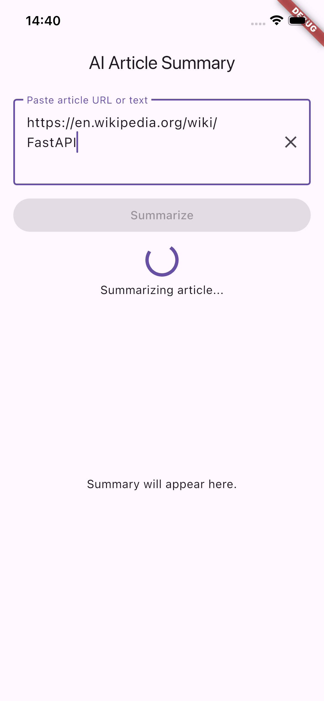
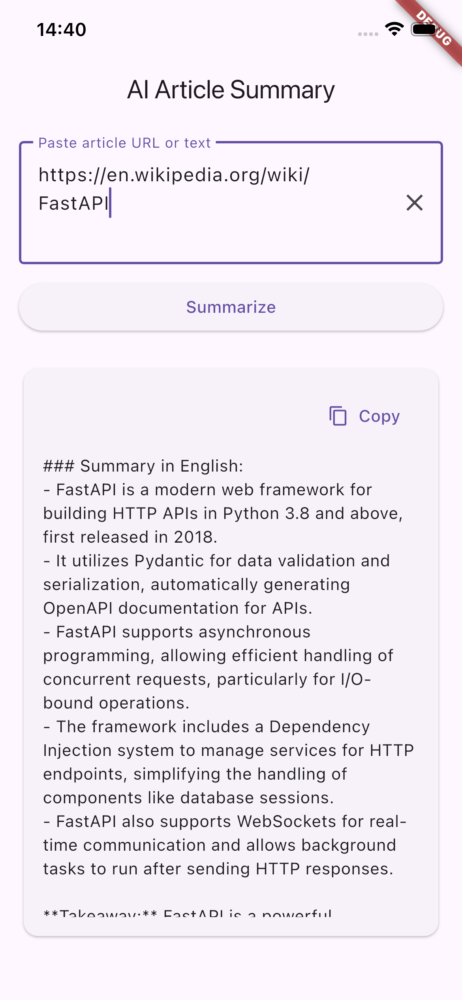
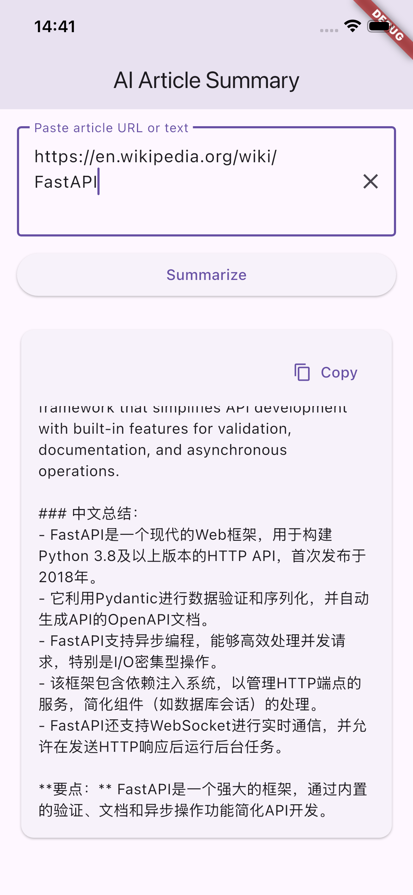
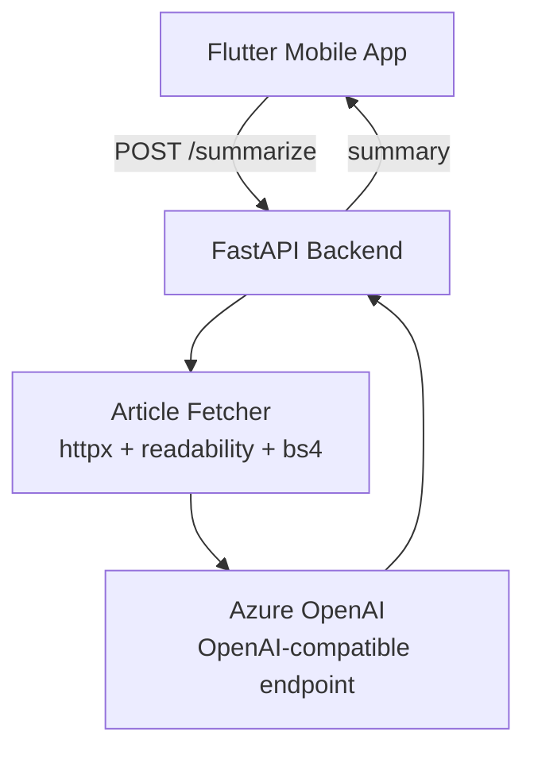

# AI Summary App

Version: v0.1


An AI-powered mobile application that summarizes web articles using Large Language Models.

Users can paste any article URL or text and receive concise summaries in both English and Chinese.

---

## Demo Screenshot

<p align="center">
  
  
  
</p>

---

## Features

- Summarize articles from URL
- Extract main content from webpages
- Generate summaries using AI
- English + Chinese summaries
- Mobile UI built with Flutter
- Backend API built with FastAPI
- Azure OpenAI integration

---

## Tech Stack

Frontend
- Flutter

Backend
- FastAPI
- Python

AI
- Azure OpenAI

Web Content Extraction
- Readability
- BeautifulSoup

---

## Architecture



---

## Quick Start

### 1) Backend setup

```bash
cd backend
python3 -m venv .venv
source .venv/bin/activate
python3 -m pip install -r requirements.txt
cp .env.example .env
```

Fill `.env` with your Azure OpenAI values:
- `AZURE_OPENAI_API_KEY`
- `AZURE_OPENAI_ENDPOINT`
- `AZURE_OPENAI_DEPLOYMENT`

Run backend:

```bash
uvicorn app.main:app --reload
```

### 2) Mobile setup

```bash
cd mobile/ai_summary_app
flutter pub get
flutter run --dart-define=API_BASE_URL=http://127.0.0.1:8000
```

Android emulator usually uses:

```bash
flutter run --dart-define=API_BASE_URL=http://10.0.2.2:8000
```

---

## Environment Variables

Backend variables:

| Variable | Default | Purpose |
|---|---:|---|
| AZURE_OPENAI_API_KEY | required | Azure OpenAI API key |
| AZURE_OPENAI_ENDPOINT | required | Azure endpoint, e.g. `https://xxx.openai.azure.com` |
| AZURE_OPENAI_DEPLOYMENT | required | Chat model deployment name |
| MAX_INPUT_CHARS | 12000 | Max input chars accepted by API |
| LLM_TIMEOUT_SECONDS | 30 | Timeout for LLM call |
| LLM_MAX_RETRIES | 2 | Retry count for LLM call |
| LLM_RETRY_BASE_DELAY_SECONDS | 1.0 | Exponential backoff base delay for LLM retries |
| FETCH_TIMEOUT_SECONDS | 15 | Timeout for URL fetch |
| FETCH_MAX_RETRIES | 2 | Retry count for URL fetch |
| FETCH_RETRY_BASE_DELAY_SECONDS | 1.0 | Exponential backoff base delay for URL fetch retries |

Mobile runtime variable:

| Variable | Default | Purpose |
|---|---:|---|
| API_BASE_URL | `http://127.0.0.1:8000` | FastAPI backend base URL |

---

## API Behavior

### POST `/summarize`

Request body:
- Text mode: `{"text":"..."}`
- URL mode: `{"url":"https://..."}`  
- Exactly one of `text` or `url` must be provided.

Common response codes:
- `200`: success
- `400`: invalid request or URL fetch/parse failure
- `413`: input text too long
- `502`: upstream LLM unavailable
- `504`: upstream LLM timeout

Response headers:
- `X-Request-ID`: request trace id for troubleshooting

---

## Testing

Backend:

```bash
cd backend
./.venv/bin/python3 -m pytest -q
```

Optional compile check:

```bash
./.venv/bin/python3 -m compileall app
```

---

## Troubleshooting

- `No module named pytest`: install deps with the same Python executable you use to run tests (`./.venv/bin/python3 -m pip install -r requirements.txt`).
- Flutter app cannot reach backend: verify `API_BASE_URL` for your target emulator/device.
- URL summarize returns short-text error: target page may be behind paywall/cookie wall; paste raw text directly.

---

## Future Improvements

- History of summarized articles
- Share summaries
- Support PDF summarization
- Support more languages
